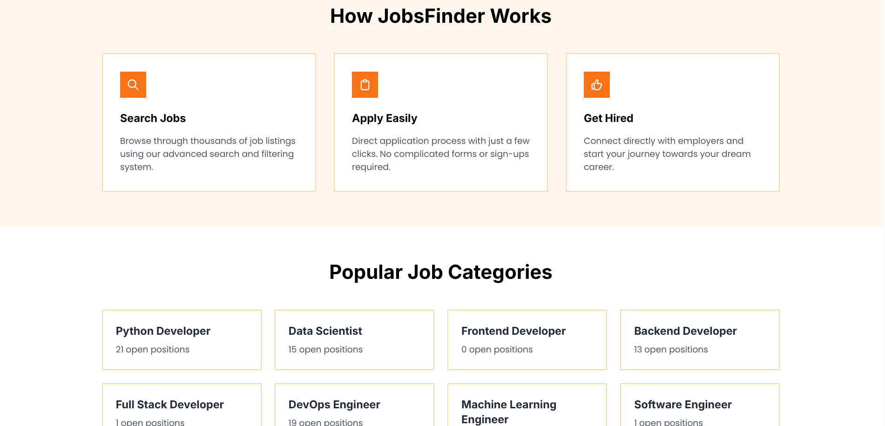
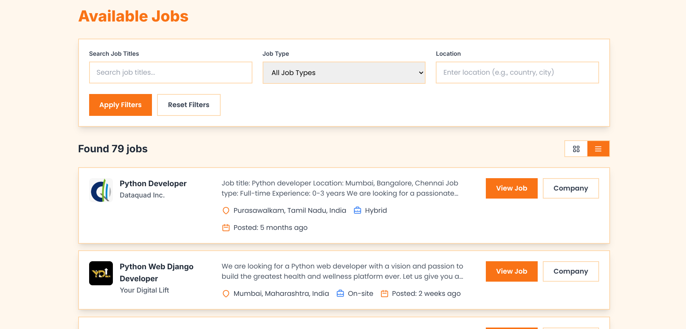
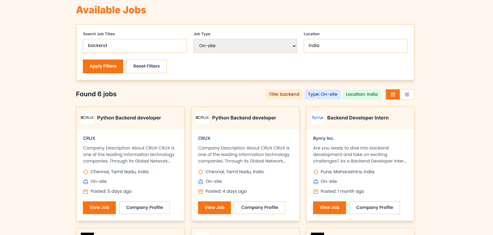

# 🔍 Jobo - Job Finder

[](https://www.djangoproject.com/)
[](https://www.python.org/)
[](https://opensource.org/licenses/MIT)

> A modern web application that helps users discover and track job opportunities from LinkedIn with a clean, intuitive interface.







## ✨ Features

- **🔎 Smart Job Search** - Find relevant jobs using keywords, location, and advanced filters
- **📋 Detailed Job Listings** - Access comprehensive job information including company details, job descriptions, and direct application links
- **🔖 Job Tracking** - Save and organize interesting job postings for later review
- **📱 Responsive Design** - Enjoy a seamless experience across desktop, tablet, and mobile devices

## 🛠️ Technology Stack

| Component    | Technology                                     |
| ------------ | ---------------------------------------------- |
| **Backend**  | Django (Python web framework)                  |
| **Frontend** | HTML, CSS, JavaScript                          |
| **Database** | PostgreSQL (production) |
| **Job Data** | Integration with LinkedIn job listings         |

## 🚀 Getting Started

### Prerequisites

- Python 3.8 or higher
- pip (Python package manager)

### Installation

1. **Clone the repository:**

   ```bash
   git clone https://github.com/yourusername/job-finder.git
   cd job-finder
   ```

2. **Create and activate a virtual environment:**

   ```bash
   python -m venv venv

   # On Windows:
   venv\Scripts\activate

   # On macOS/Linux:
   source venv/bin/activate
   ```

3. **Install dependencies:**

   ```bash
   pip install -r requirements.txt
   ```

4. **Run migrations:**

   ```bash
   python manage.py migrate
   ```

5. **Start the development server:**

   ```bash
   python manage.py runserver
   ```

6. **Open your browser** and navigate to `http://127.0.0.1:8000/`

## 📖 Usage Guide

1. **Search for Jobs**

   - Enter keywords, job titles, or skills
   - Specify location or set to "Remote"
   - Apply additional filters as needed

2. **Explore Job Details**

   - Click on any job listing to view comprehensive information
   - Review company profiles, job requirements, and responsibilities

3. **Apply for Positions**
   - Follow the application links to apply directly on LinkedIn
   - Track application status for positions you're interested in
